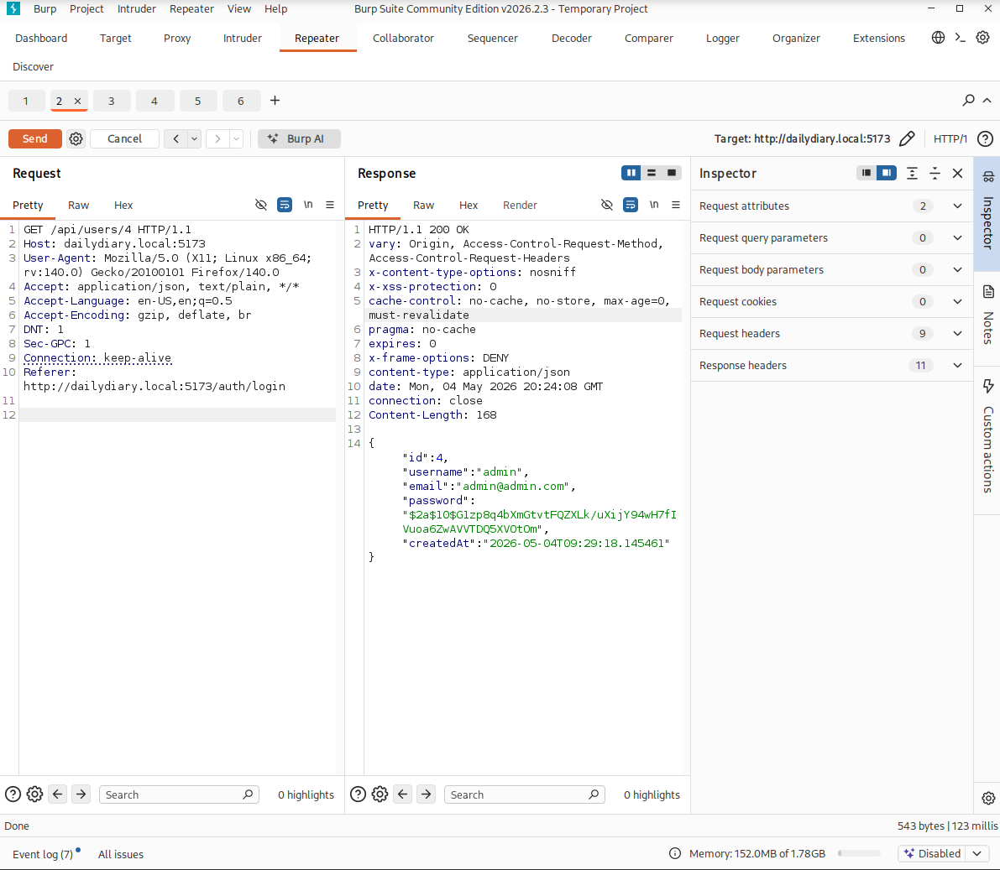
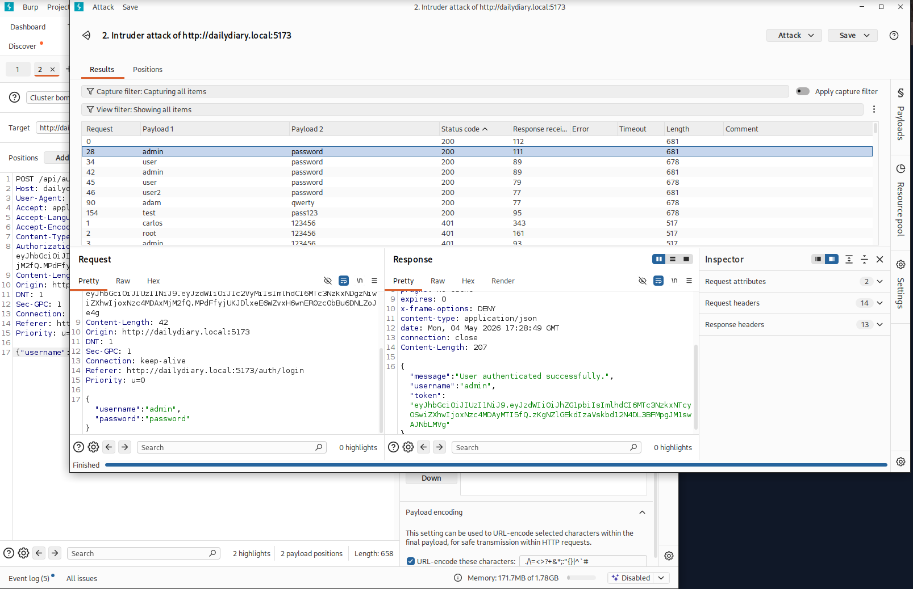
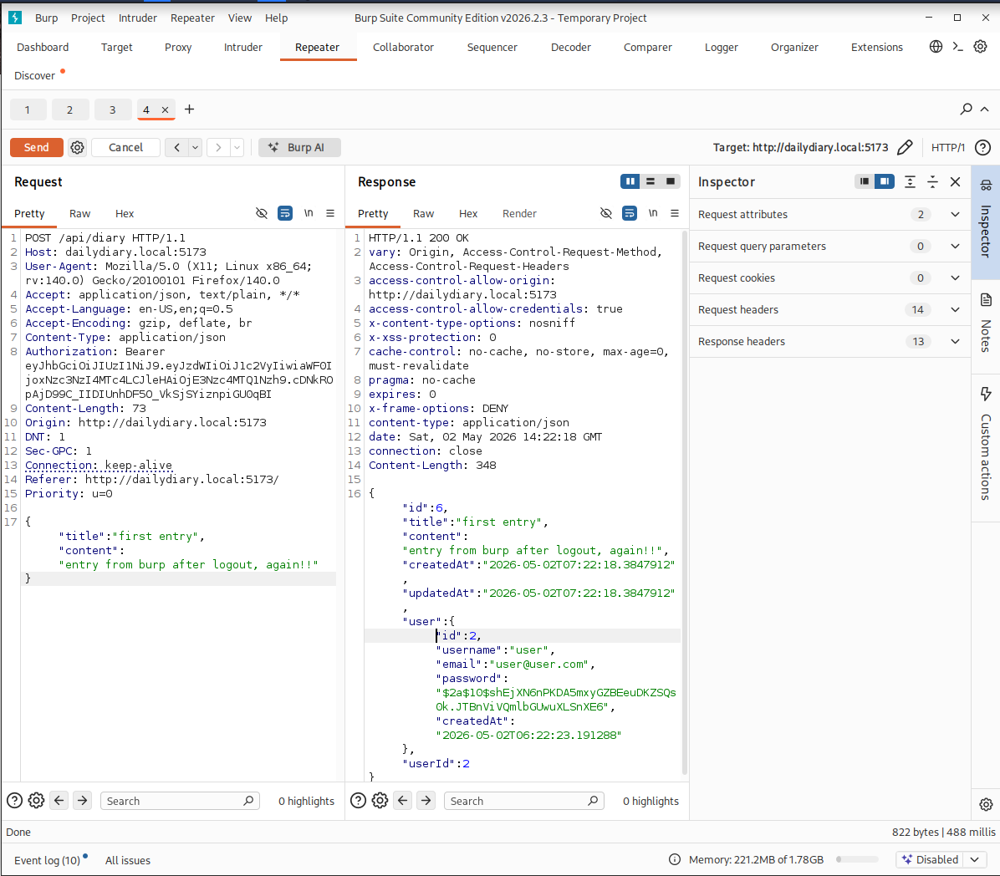

# Diary App Pentest Report

## Scope
- Application: Daily Diary App
- Environment: Local lab
- Target: Windows 10 VM (192.168.56.102)
- Attacker: Kali Linux VM (192.168.56.103)
- Network: Host-only VirtualBox lab

---

## Setup

### Host
- Development: WSL + Visual Studio Code
- Build System: Java Maven-based backend

### Target (Windows 10 VM)
- Java Spring Boot backend
- MySQL database (diary_app)
- Exposed API over HTTP

### Attacker (Kali Linux VM)
- Recon & testing environment
- Tools: nmap, curl, browser DevTools

---

## System Overview

- Host-only network: 192.168.56.0/24
- Kali: 192.168.56.103
- Windows: 192.168.56.102
- NAT enabled for external connectivity

- Backend: Spring Boot (REST API)
- Frontend: React + Vite
- API Base: http://192.168.56.102:8080/api

---

## Deployment Notes

- SSL disabled for testing
- Application runs over HTTP (port 8080)
- API accessible from both host and Kali VM

---

## Findings

## 🔴 Finding 1: Signup Error Not Displayed in UI

**Severity:** Low

### Description
Backend returns error message, but UI does not display it.

### Evidence
- "Username or email already taken."

### 🟢Recommendation
Show backend error message in frontend.

---

## 🔴 Finding 2: Improper Session Invalidation Allows Access After Logout

**Severity:** High 

**Type:** Authentication

---

### Description

The application fails to properly invalidate the JWT token upon user logout. After logging out, the previously issued token remains valid and can still be used to access authenticated areas of the application.

---

### Evidence

* JWT token remains present after logout in browser storage
* Access to protected route (`/test`) is still possible after logout
* User is able to re-enter the application without re-authentication

---

### Steps to Reproduce

1. Log in to the application
2. Observe the issued JWT token in browser storage
3. Log out of the application
4. Confirm the JWT token is still present
5. Navigate to `/test`
6. Observe that access is granted without re-authentication

---

### Impact

An attacker with access to a previously issued token can continue to access the application even after logout. This breaks expected authentication guarantees and increases risk of unauthorized access, especially on shared or compromised devices.

---

### 🟢 Recommendation

* Remove JWT token from client storage upon logout
* Implement token invalidation strategy (e.g., blacklist or short-lived tokens with refresh rotation)
* Ensure backend verifies token validity beyond signature (e.g., check revocation status)
* Enforce authentication on all protected endpoints regardless of frontend routing

---

## 🔴 Finding 3: Sensitive Data Exposure in API Response

**Severity:** Medium

**Type:** Information Disclosure

---

### Description

The API response for diary entries exposes sensitive user information, including the hashed password. This violates data minimization principles and unnecessarily exposes internal user data.

---

### Evidence

API response includes:

* Full user object
* Hashed password (`$2a$10$...`)

  

---

### Steps to Reproduce

1. Log in to the application
2. Send a POST request to `/api/diary`
3. Observe the API response
4. Note that the response includes the full user object and hashed password

---

### Impact

An attacker can obtain hashed passwords and sensitive user details, which may be used for offline cracking or further attacks. This also increases the attack surface by exposing internal data structures.

---

### 🟢 Recommendation

* Remove sensitive fields (e.g., password) from API responses
* Use DTOs to control exposed data
* Return only necessary fields for functionality

---

## 🔴 Finding 4: Missing Rate Limiting on Authentication Allows Brute Force Attacks

**Severity:** High

**Type:** Authentication

---

### Description

The authentication endpoint does not implement rate limiting or account lockout mechanisms. This allows an attacker to perform unlimited login attempts and brute force user credentials.

---

### Evidence

* Multiple login attempts (350+ requests) were sent using Burp Intruder
* No rate limiting, delays, or account lockout observed
* Valid credentials were successfully identified through repeated attempts
  

---

### Steps to Reproduce

1. Intercept a login request (e.g., POST `/api/auth/login`)
2. Send the request to Burp Intruder
3. Use a list of common passwords or known credentials
4. Launch the attack with multiple attempts
5. Observe that:

   * No rate limiting is enforced
   * No account lockout occurs
   * Valid credentials can be discovered

---

### Impact

An attacker can perform brute force attacks to guess user credentials and gain unauthorized access to accounts. This significantly weakens authentication security, especially for users with weak passwords.

---

### 🟢 Recommendation

* Implement rate limiting on login attempts
* Add account lockout after multiple failed attempts
* Introduce CAPTCHA after repeated failures
* Monitor and log suspicious authentication activity

---

## 🟠 Finding 5: Improper Input Validation and Error Handling in Diary API

**Severity:** Medium

**Type:** Input Validation / Error Handling

---

### Description

The diary API does not properly validate incoming request data and fails to handle invalid or unexpected input safely. Supplying malformed or unexpected fields in requests results in server-side errors (HTTP 500) instead of controlled validation responses.

Additionally, the API accepts and processes extraneous fields (e.g., `user`, `userId`, timestamps) that should not be client-controlled, indicating weak input validation and unsafe object binding.

---

### Evidence

* Sending modified or malformed requests (e.g., including full `user` object or invalid IDs) results in:

  * `HTTP/1.1 500 Internal Server Error`
* Accessing non-existent resources (e.g., `/api/diary/999999`) also triggers a 500 error
* API accepts unexpected fields such as:

  * `user`
  * `userId`
  * `createdAt`
  * `password` (nested in user object)

---

### Steps to Reproduce

1. Intercept a valid request to `PUT /api/diary/{id}`
2. Modify the request body to include unexpected or malformed fields:

   * Add full `user` object
   * Alter `userId`
   * Include timestamps or other internal fields
3. Send the request
4. Observe:

   * Inconsistent behavior (some requests succeed, others trigger HTTP 500)
5. Send a request to a non-existent resource:

   * `GET /api/diary/999999`
6. Observe HTTP 500 response instead of 404

---

### Impact

* Server crashes (500 errors) indicate unhandled exceptions and weak validation logic
* Acceptance of client-controlled internal fields increases risk of:

  * Data integrity issues
  * Future privilege escalation vulnerabilities
  * Logic manipulation as the application evolves
* Improper error handling may expose backend weaknesses and aid attackers in probing application behavior

---

### 🟢 Recommendation

* Implement strict input validation (whitelisting allowed fields only)
* Reject unexpected or extra fields in request payloads
* Use Data Transfer Objects (DTOs) instead of directly binding request bodies to entities
* Return appropriate HTTP status codes:

  * `400 Bad Request` for invalid input
  * `404 Not Found` for non-existent resources
  * `403 Forbidden` for unauthorized access
* Add global exception handling to prevent unhandled server errors

---

## 🔴 Finding 6: Account Compromise via Chained Authentication and Validation Weaknesses

**Severity:** High

**Type:** Authentication / Data Exposure / Security Misconfiguration

---

### Description

Multiple security weaknesses in the application can be chained together to achieve unauthorized account access and persistent session abuse.

The application lacks rate limiting on authentication, fails to invalidate JWT tokens upon logout, and exposes sensitive user data in API responses. These issues combined allow an attacker to gain access to user accounts and maintain that access even after logout.

---

### Attack Scenario

1. The attacker performs a brute force attack on the login endpoint due to lack of rate limiting
2. Valid user credentials are successfully obtained
3. The attacker authenticates and receives a valid JWT token
4. The victim logs out, but the JWT token remains valid
   
5. The attacker continues to use the token to access protected endpoints
6. The attacker retrieves sensitive user data (including hashed passwords) from API responses

---

### Impact

* Unauthorized account access
* Persistent access even after user logout
* Exposure of sensitive user data
* Increased risk of credential reuse attacks and offline password cracking

---

### 🟢 Recommendation

* Implement rate limiting and account lockout on authentication endpoints
* Properly invalidate JWT tokens on logout (e.g., token blacklist or short expiration)
* Remove sensitive data from API responses
* Enforce strict input validation and error handling across endpoints

---
---

# Remediation Log (fixes applied)

> All findings below were remediated in code. This section records what was
> changed for each original finding, then documents **additional vulnerabilities
> discovered during remediation** and how they were fixed.

## Status of original findings

| # | Finding | Severity | Status | Fix summary |
|---|---------|----------|--------|-------------|
| 1 | Signup error not displayed in UI | Low | ✅ Fixed | `Signup.jsx`/`Login.jsx` now read both string and `{message}` error bodies and display the backend message. |
| 2 | Improper session invalidation after logout | High | ✅ Fixed | Added `/api/auth/logout` + server-side `TokenBlacklist` (JWT revoked on logout), and the frontend now removes the token and calls logout. Tokens also shortened to 1h and checked for expiry on load. |
| 3 | Sensitive data exposure (password hash in API) | Medium | ✅ Fixed | `password` is now `@JsonProperty(WRITE_ONLY)`; diary/user responses use DTOs (`DiaryResponse`, `UserResponse`) that never include the user object/hash. |
| 4 | Missing rate limiting on auth | High | ✅ Fixed | `LoginAttemptService` locks an IP+username after 5 failed attempts for 15 minutes (HTTP 429). |
| 5 | Improper input validation & error handling | Medium | ✅ Fixed | Bean Validation on all DTOs + `@Valid`; `GlobalExceptionHandler` returns 400/403/404 instead of 500; DTOs prevent unsafe entity binding. |
| 6 | Account compromise via chained weaknesses | High | ✅ Fixed | Addressed by the combination of #2, #3, #4 above plus the access-control fixes below. |

---

# Additional Findings (discovered during remediation — now fixed)

## 🔴 Finding A — Cleartext Password Logged to Console

**Severity:** High

**Type:** Data & Secrets

### Description
`AuthService.login()` printed the raw login password to stdout
(`System.out.println("AuthManager pass " + request.getPassword())`). Anyone with
access to console output or log files could harvest cleartext credentials.

### Impact
Full credential disclosure for every user who logs in.

### 🟢 Remediation Applied
The logging statement was removed entirely. Credentials are never logged.

---

## 🔴 Finding B — Broken Access Control: Catch-all `permitAll()`

**Severity:** Critical

**Type:** Broken Access Control

### Description
`SecurityConfig` ended its rules with `.anyRequest().permitAll()`, leaving every
endpoint not explicitly listed — including the entire `/api/users/**` user
management API — publicly accessible without authentication.

### Impact
Anyone could read and modify user accounts without logging in.

### 🟢 Remediation Applied
Changed to deny-by-default: only `/api/auth/signup` and `/api/auth/login` are
public; `.anyRequest().authenticated()`. The session policy is now `STATELESS`
and unauthenticated API calls return `401` instead of a form redirect.

---

## 🔴 Finding C — Account Takeover via Unauthenticated User Update

**Severity:** Critical

**Type:** Authentication / Broken Access Control

### Description
`PUT /api/users/{id}` accepted the full `User` entity and updated username,
email, and password for any ID, with no authentication or ownership check
(reachable because of Finding B).

### Impact
An attacker could reset any user's password and take over any account.

### 🟢 Remediation Applied
The endpoint now requires authentication, enforces `requireSelf(id)` so a user
can only modify their own account, binds a restricted `UserUpdateRequest` DTO,
and re-hashes the password with BCrypt on update.

---

## 🔴 Finding D — Public, Unauthenticated User-Creation Storing Plaintext Passwords

**Severity:** Critical

**Type:** Authentication / Data & Secrets

### Description
`POST /api/users` (`UserController.createUser`) saved the incoming `User` entity
directly via `userService.saveUser(user)` — **without encoding the password**.
Combined with Finding B it was publicly reachable, so attackers could create
accounts whose passwords were stored in clear text in the database.

### Impact
Plaintext credential storage and an unauthenticated account-creation backdoor
separate from the real signup flow.

### 🟢 Remediation Applied
The endpoint was removed. Account creation happens only through
`POST /api/auth/signup`, which always BCrypt-hashes the password.

---

## 🔴 Finding E — IDOR: Read Any User's Diary Entry

**Severity:** High

**Type:** Broken Access Control

### Description
`GET /api/diary/entry/{id}` returned an entry by ID with no ownership check, so
any logged-in user could read any other user's entry.

### 🟢 Remediation Applied
`getEntryById(id, userId)` now verifies ownership and throws `403` for another
user's entry and `404` if it does not exist.

---

## 🔴 Finding F — IDOR: Delete Any User's Diary Entry

**Severity:** High

**Type:** Broken Access Control

### Description
`DELETE /api/diary/{id}` deleted by ID with no ownership check, letting any
logged-in user delete other users' entries.

### 🟢 Remediation Applied
`deleteEntry(id, userId)` now enforces ownership (403/404) before deleting. The
controller derives the user from the authenticated principal, not the request.

---

## 🟠 Finding G — Mass Assignment via Raw Entity Binding

**Severity:** Medium

**Type:** Logic & Configuration

### Description
User endpoints bound the full `User` JPA entity from the request body, allowing
attackers to attempt to set protected fields (`id`, `createdAt`).

### 🟢 Remediation Applied
All write endpoints bind narrow DTOs (`UserUpdateRequest`, `CreateDiaryRequest`)
that expose only the editable fields. Server-managed fields cannot be set by the
client.

---

## 🟠 Finding H — Insecure JWT Storage in `localStorage`

**Severity:** Medium

**Type:** Authentication & Session

### Description
The JWT is stored in `localStorage`, which is readable by any JavaScript and
therefore exposed to token theft if an XSS bug is ever introduced.

### 🟢 Remediation Applied (partial / hardened)
Token lifetime was reduced to 1 hour, tokens are revoked server-side on logout
(blacklist), and the client clears the token on any `401`. **Recommended further
hardening:** move the token to an `HttpOnly`, `Secure`, `SameSite` cookie so it
is never reachable from JavaScript (requires CSRF protection to be re-enabled).
This is a larger architectural change and is left as a documented next step.

---

## 🟠 Finding I — Vulnerable / Risky Dependencies & DevTools in Build

**Severity:** Medium

**Type:** Components with Known Vulnerabilities

### Description
The build used Spring Boot 3.5.4 and JJWT 0.11.5 (flagged for known CVEs) and
shipped `spring-boot-devtools`, whose remote restart/debug surface has been
abused for RCE.

### 🟢 Remediation Applied
Upgraded Spring Boot to 3.5.8 and JJWT to 0.12.6 (with the corresponding API
migration), and removed the `spring-boot-devtools` dependency. Keep running a
dependency scanner (e.g. `mvn dependency-check`) in CI.

---

## 🟢 Finding J — Cleartext HTTP (previously reported)

**Severity:** Low

**Type:** Network & Communication

### Description / Status
The runtime was already moved to HTTPS (port 8443, SSL keystore) and the
frontend base URL is `https://localhost:8443/api`, so this is addressed. The
example config also now disables SQL logging and suppresses error
message/stacktrace leakage in responses for production.

---

# Closing Note

This penetration test identified several security vulnerabilities within 
the Daily Diary application, including weaknesses in authentication, 
authorization, session management, input validation, and information disclosure. 

All identified findings were remediated and successfully retested. The implemented 
improvements have significantly strengthened the application's overall security 
posture. Continued security testing and regular maintenance are recommended 
to help ensure the application remains secure as it evolves.

